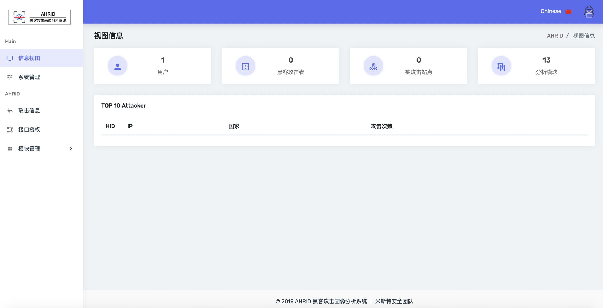
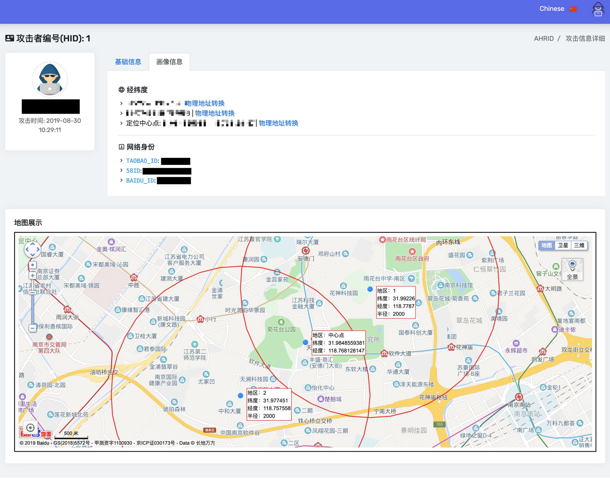
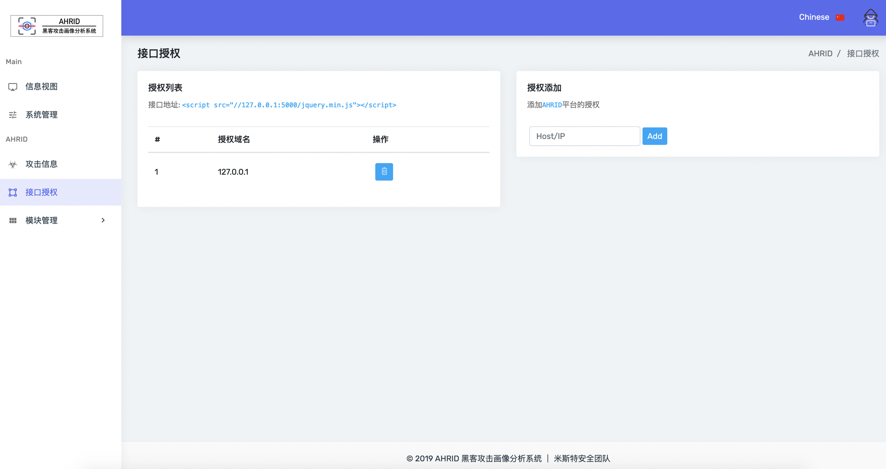
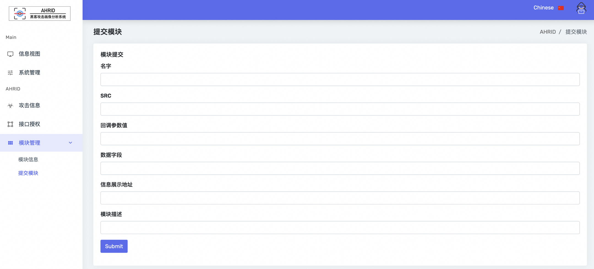
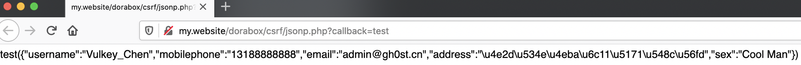
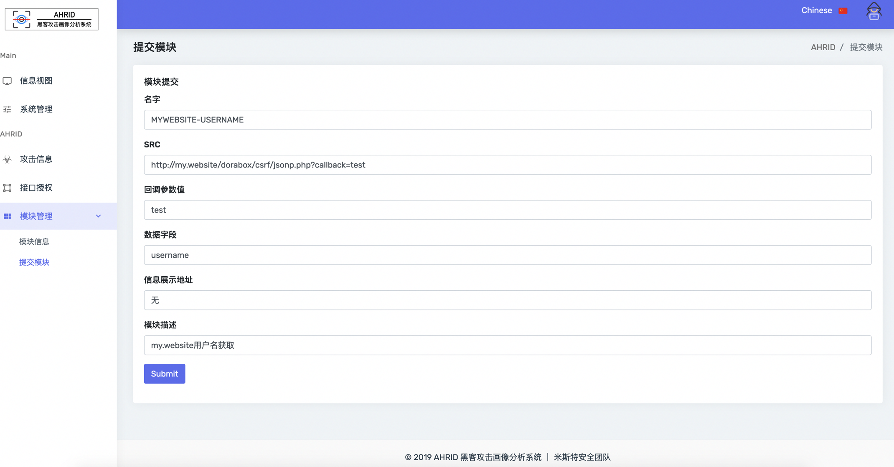

# AHRID

## **前言**

**注**：**这是一个即兴生产的小平台，不喜勿喷。**

**另**：开源部分功能可能不符开源项目名称，见谅。

**开发初衷**：笔者曾混迹过各种攻防演练活动，参与过防守方、攻击方，也算是大概了解了每一个队伍的任务～参加防守时印象尤为深刻，也跟一起防守的“战友”做过有趣的事情，例如：反打攻击队；题外话说的有点多了，来说说为什么开发这样一个平台：作为一个防守方光看日志固然是枯燥无味的，偶尔来几次反向打击啥的，增添防守的乐趣～所以我想到了做这样一个系统，就是想在“空暇”时间能获取点“黑客攻击者”的“画像”。


## **AHRID开源版介绍**

英文名:AHRID，中文名字:黑客攻击画像分析系统，定义：反攻击分析平台。



本平台采用被动式的方式分析黑客攻击者画像，可扩展赋能蜜罐以及安全设备，将平台接口部署在蜜罐Web界面上即可，当攻击者访问所部署的Web界面即触发平台分析功能，对访问者进行分析，数据回传平台分析其网络身份、IP、IP定位：物理地址等信息。



平台支持接口授权的方式授权站点，已授权站点才可使用平台接口进行被动式的攻击者画像分析以及数据回传。



平台的分析功能采用模块化设计，可针对不同的分析功能新建不同的分析模块进而让平台的分析功能更加丰富完善（**开源版本目前只支持JSONP探针模块**）




## **AHRID开源版使用**

### **授权使用**

登录进AHRID平台之后需要先添加接口授权：


当添加完毕后，复制接口代码至蜜罐页面或需监测的页面中即可（建议复制到最后），这样就已经部署成功了，只需要等待攻击者触发数据回传功能，等待画像信息即可。

### **模块提交**

当已经发现一个JSONP劫持漏洞时，即可提交到AHRID平台上：




漏洞地址：http://my.website/dorabox/csrf/jsonp.php?callback=test 要获取的信息：username

模块提交说明：
1.    名字<->模块名字（建议使用英文）
2.    SRC<->存在JSONP劫持漏洞的URL地址
3.    回调参数值<->回调参数的值（参数=值）
4.    数据字段<->JSON字段（例如：{"username":"123"}，要获取的是username即填写username；例如：{"data":{"uid":"123"}}，要获取的是uid即填写data.uid）
5.    信息展示地址一般填写无或者随意填写
6.    模块描述根据模块功能说明




## **AHRID开源版设计概述**

当攻击者访问到部署了AHRID接口的页面，即触发JSONP探针获取攻击者已登录状态下的登录信息，回传登录信息+IP+UA，后端会对IP进行物理地址转换，最终将数据记录到数据库。

**数据库结构**

>**表：**Admin - **列：**id,username,password
>
>**表：**Hackinfo - **列：**hid,host,ip,user_agent,jsondata,creaye_time,times
>
>**表：**Plugins - **列：**pid,name,src,callback,columns,url,commit
>
>**表：**Apis - **列：**aid,host

**IP地址转换依赖**：GeoLite2-City.mmdb

**IP定位依赖**：接口 apis.map.qq.com、way.jd.com + 取中心点

**依赖环境**：Python2 + Flask + Mysql

**所需网络环境**：互联网（可出网）

## **AHRID开源版搭建**

1.config.py 配置文件修改

需要配置的信息如下：

```txt
USERNAME: Mysql用户名

PASSWORD: Mysql用户密码

HOST: Mysql主机地址

PORT: Mysql端口

SECRET_KEY: SESSION 秘钥（建议16位以上随机英文字母+数字+特殊符号）

TX_KEYS: 腾讯接口KEYS（2个以上，参考：https://lbs.qq.com/webservice_v1/guide-ip.html ）

JCLOUD_KEY: 京东云接口KEY（Github可白嫖）
```

2.Mysql创建“ahrid”数据库

3.执行如下代码

```shell
python manage.py db init

python manage.py db migrate
```

4.启动服务：**sudo python app.py**

默认端口为：80，可自行修改app.py文件如下代码部分

```python
server = pywsgi.WSGIServer(('0.0.0.0', 80), app)
```

## **最后**

致谢**AHRID开发者团队成员**：Vulkey_Chen、EvilChen、林晨、奶权

开源地址：https://github.com/gh0stkey/ahrid

专业版本介绍：根据攻击规则触发探针、自带13+分析模块（可持续维护6个月）、定制化数据展示... 联系邮箱：admin[#]hi-ourlife.com